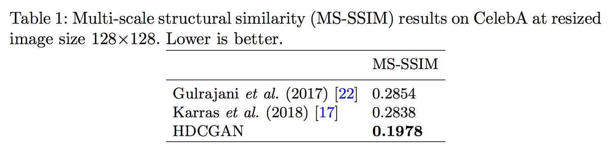

# Curtó & Zarza
Curtó is the first GAN (Generative Adversarial Networks) augmented dataset of faces. A key step towards Artificial General Intelligence (AGI).

Neil Armstrong — 'That's one small step for a man, one giant leap for mankind'

Link to Download:

<a href="https://drive.google.com/open?id=1q-FC_wztJ5vRHnb5zu7EzTN89xoBXr1-">Curtó & Zarza (4 GB).</a>

Alternate Links to Download:

<a href="https://share.weiyun.com/5OsGy9A">Curtó & Zarza (4 GB).</a>

<a href="https://share.weiyun.com/5a41KnC">Curtó & Zarza (4 GB).</a>

--------------------------------------------------------
Curtó & Zarza 
--------------------------------------------------------

Department of Computer Science and Engineering. 
The Chinese University of Hong Kong.

For more information about the dataset, visit the website:

  http://curto.hk/publication/hdcgan/

If you use the dataset in a publication, please cite the paper below:

Curtó, J. D., Zarza, I. C., Torre, F., King, I., Lyu, M. R.
High-resolution Deep Convolutional Generative Adversarial Networks. 2017.

Please note that we do not own the copyrights to these images. Their use is RESTRICTED to non-commercial research and educational purposes.

--------------------------------------------------------
Change Log
--------------------------------------------------------

Version 1.0, released on 17/11/2017.

Version 1.1, released on 21/11/2017, add labels with attribute information.

Version 1.2, released on 19/01/2018, add supplementary samples and labels.

Version 1.3, released on 27/01/2018, add HDCGAN Synthetic Images.

Version 2.0, released on 09/02/2018, add HDCGAN HQ Synthetic Images.

--------------------------------------------------------
File Information
--------------------------------------------------------

- Samples (c/samples)
      14,248 cropped faces. Balanced in terms of ethnicity: African American, East-asian, South-asian and White. Mirror images included to enhance pose variation.
- Labels (c/labels)
      JSON files with attribute information: Gender, Age, Ethnicity, Hair Color, Hair Style, Eyes Color, Facial Hair, Glasses, Visible Forehead, Hair Covered and Smile.
- HDCGAN Synthetic Images (c/hdcgan)
      4,239 faces generated by HDCGAN trained on CelebA. 
	- Samples (c/hdcgan/samples)
		      Original 512x512 image size.
  	- Resized Samples (c/hdcgan/samples_128)
		      128x128 image size. 
- Additional Images (c/extra)
	- Samples (c/extra/samples), Labels (c/extra/labels)
      		3,384 cropped faces with labels, Ethnicity: White.
